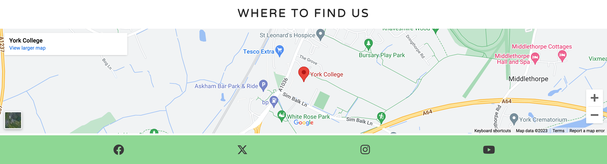
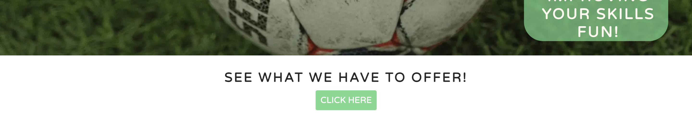
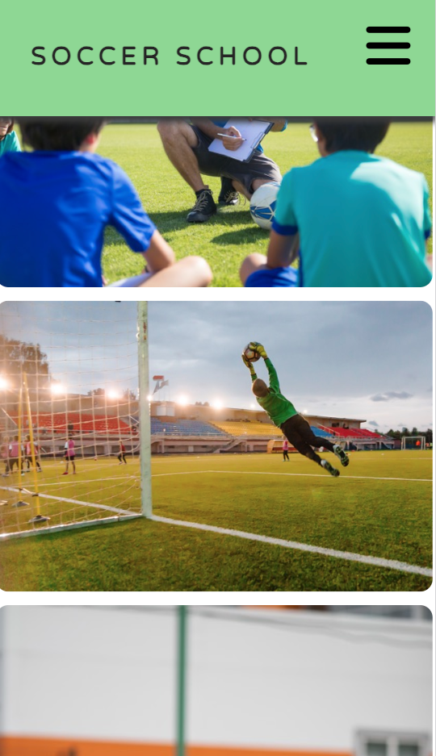
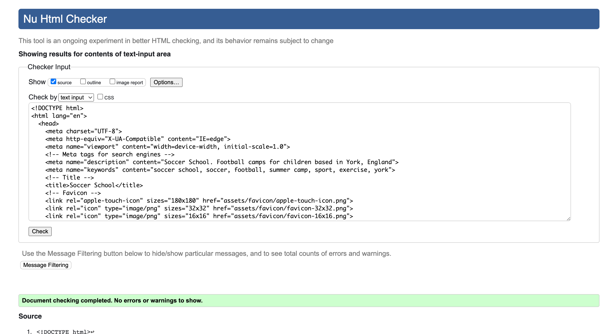
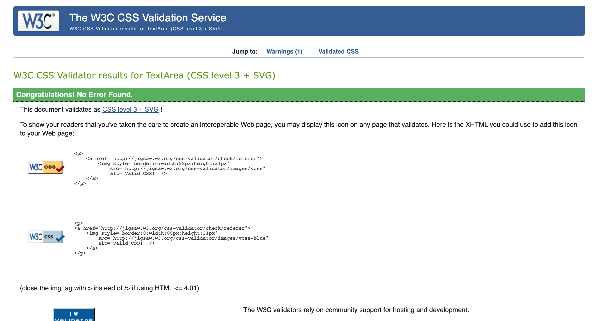
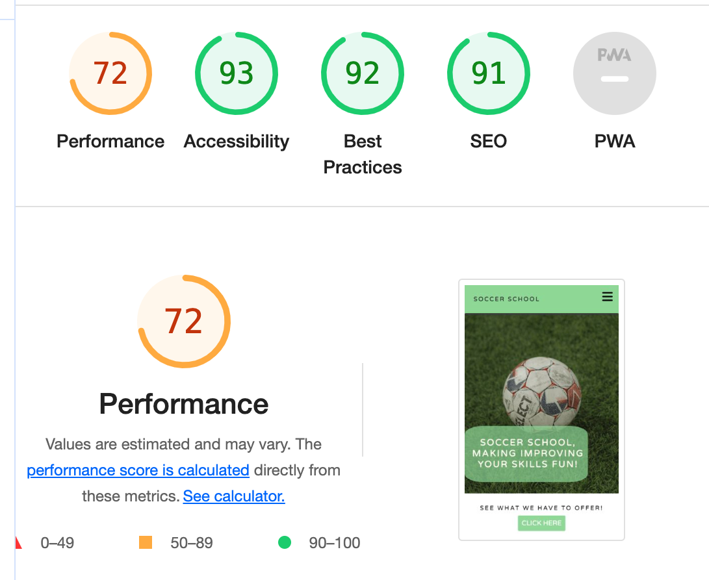
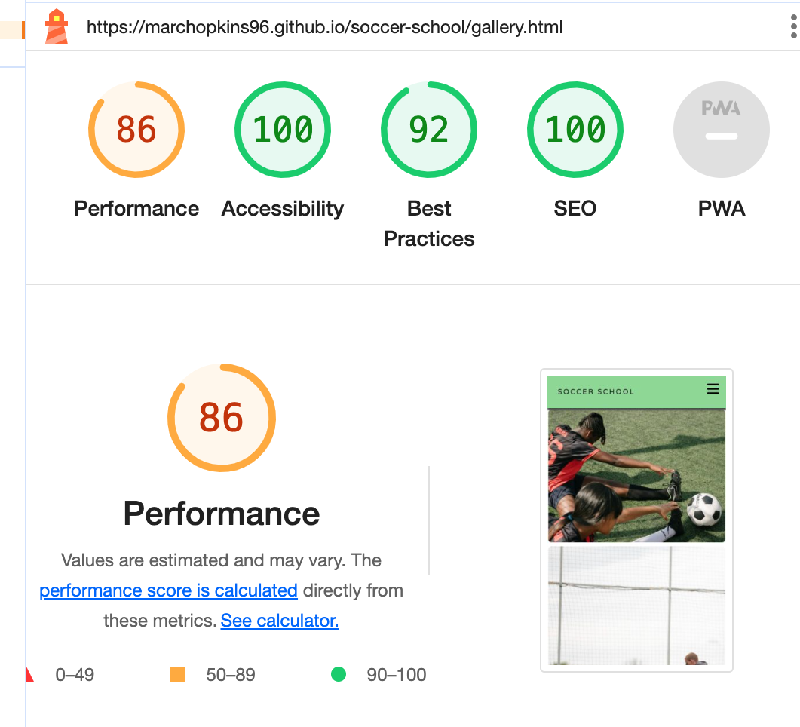
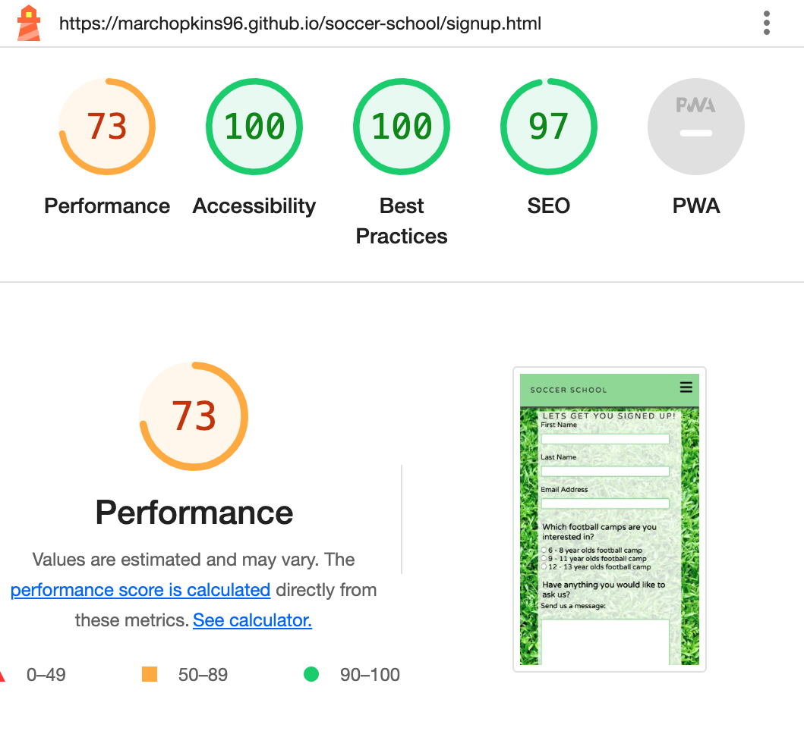
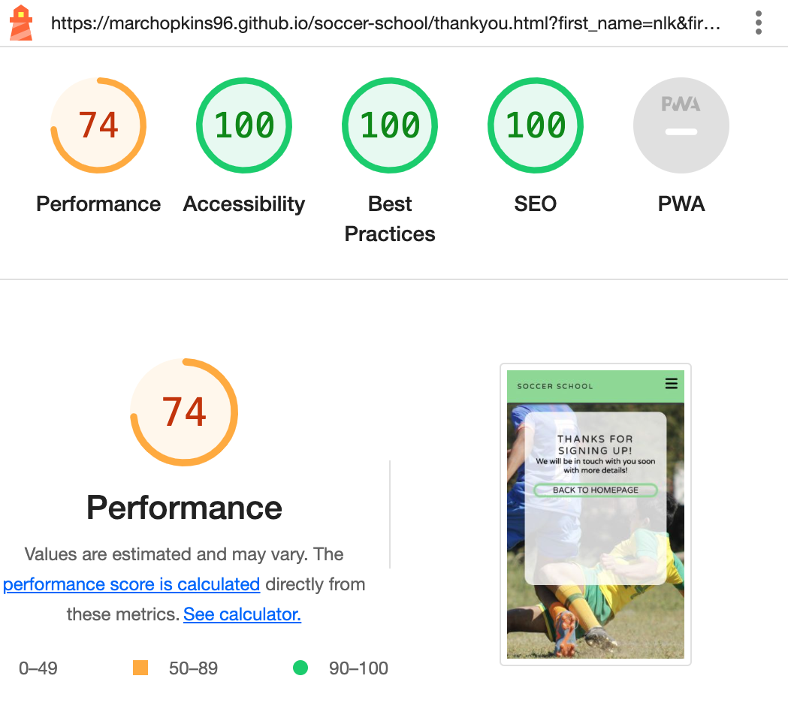

# Soccer School
(Developed by: Marc Hopkins)

[Live webpage](https://marchopkins96.github.io/soccer-school/index.html)

## Introduction

Soccer School is a football camp based at York College, England, The football camps are for children aged between 6 - 13 years old. The site is targeted at parents of children who may want to improve their footballing abilities in a fun and engaging environment.

## Project Goals 

### User Goals

- I want to be able to find the services that are offered easily and quickly
- I want to be able to find any social media feeds
- I want to be able to ask questions
- I want to see images of past football camps
  
### Website owner goals 

- Attract parents and their children to the site
- Promote learning to play football in a fun way
- Increase the flow of site traffic by making it eye catching and easy to navigate
- Promote inclusion in sports and a feeling of togetherness

## Structure & Design

### Wireframes

The structure of the page will include four pages:

1. **Home Page** which has navigation features in the header and footer, an about section and a football camp times/additional information section. It will also feature a map with the location of our services.

2. **Gallery Page** which features an abundance of photos from past football camps at Soccer School. It will also feature the same header and footer as the home page.
   

3. **Sign Up Page** Which includes a form that includes name and email fields, as well as section on a childs age. There will also be a message field.

4. **Thank You Page** Which includes a thank you message and link back to home page.

### Colour Scheme & Fonts

The colour scheme is a balance of white and green throughout the website, this is to maintain a link to football through the colours used. A light green has been used for headers and footers on all pages to maintain consistency. Football related backgrounds have been used one some pages to maintain the link to the services Soccer School provides. Text has been added primarily in dark grey or black, as well as white so that readability and contrast are maintained.

Varela Round is the font that has been used the whole way throughout the website. This font was chosen as it is easy to read in large text and small text. This font also provides a clean and vibrant look to the header of the website.

### Features 

The website consists of four pages as previously shown in the wireframes, the features of those pages are as follows:

#### Header 

Screenshot of the header on desktop

Screenshot of header on mobile

Screenshot of header dropdown menu on mobile

- Featured on all four pages
- Includes the company name and a menu with links to the Home page, Gallery page and Sign Up page
- The menu within the header reduces down to a burger icon when displayed on smaller screens with a dropdown menu 
- When a user hovers over the menu options in desktop view an animation underline shows which option they are choosing

#### Footer

Screenshot of map and footer on desktop

Screenshot of map and footer on mobile

- Footer featured on all four pages
- Map link is solely feauted on the home page
- The map shows the location of where Soccer School holds its football camps
- Includes social media links to: Facebook, Twitter, Instagram and Youtube
- the social media links are all fully responsive and open up in a new tab

#### Services offered at Soccer School

- The services offered are shown in four identically bordered boxes equally spaced apart for an aesthetically pleasing look
- Age groups and days/times are included
- An additional information box is included with a call to action that links to the sign up page

#### Call to action 

- A call to action button is included directly below to the homepage image. It will link you directly to the 'Football camps at Soccer School' section when it is clicked on 

#### About us 

- An about us section is included on the home page which provides important information about Soccer School

#### Gallery page

Screenshot of the gallery page on desktop</sumamry>

Screenshot of the gallery page on mobile

- Features images of children taking part in past football camps at Soccer School
- On a mobile screen the gallery images are presented in a single image column and expand out to rows of four as a screens size increases

#### Sign up page

Screenshot of the sign up page on desktop

- Features a form that a user can fill out to express their interest in a certain service and send a message requesting more information if necessary

#### Thank you page 

Screenshot of the thank you page on desktop

- Features a thank you message and a call to action to take the user back to the home page
- This page is only reachable once the sign up form has been filled out and submitted

#### Future additions

- Add a calendar displaying all the dates which the football camps will be taking place on throughout the year

## Validation 
### HTML Validation

The W3C Markup Validation service was used to validate the HTML code

Home

- No errors or warnings

Gallery

- No errors or warnings

Sign up

- No errors or warnings

Thank you

- No errors or warnings

### CSS Validation 

The W3C Jigsaw Validation Service was used to validate the CSS code for the website

CSS Validation

- No errors or warnings

### Accessibility & Performance

The Lighthouse feature on Google Chrome Devtools was used to assess the accessibility & Performance of the website

Home

Gallery

Sign up

Thank you

- All pages generally scored high in all sections, The performance scores were lowest of all but still scored highly
- I will look to improve these scores further in the future to maintain a high level of user accessibility

## Manual Testing

All features of the website have been vigorously tested to ensure they are working as expected. Each page of the website has been tested in different browsers and at different screen sizes from desktop size down to mobile screens. I tested that my sign up form worked using Code institute form-dump before i added a thank you page in its place. 
Browsers tested on:
- Google Chrome
- Safari
- Microsoft Edge

## Technologies Used

### Languages
- HTML
- CSS

### Frameworks & Tools
- Git
- GitHub
- Google Fonts
- Font Awesome
- Pexels
- Favicon.io
- Balsamiq
- W3 Schools

## Bugs & Fixes

| **Bug** | **Fix** |
| ---------- | ---------- |
| Home page validation returned an error for a bad value relating to the 'iframe' element | Bad value removed and a CSS class created for the maps height and width | 
| On very small screens (below 253px) a thin white line appeared between the header and homepage image | Line height increased on the logo id to eliminate the line |